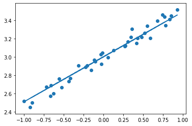

<div style="text-align:right;">Regression by using Keras</div>
<div style="text-align:right;">Brickea with material from mofan python</div>

# Regressor 回归问题

## Generate data


```python
import numpy as np
from matplotlib import pyplot as plt
```


```python
# Make sure result is same for every time
np.random.seed(120)
```


```python
X = np.linspace(-1,1,200)

# Randomlize the data
np.random.shuffle(X)
y = 0.5 * X + 3 + np.random.normal(loc=0,scale=0.05,size=(200,))
# Plot the data
plt.scatter(X,y)
```


    <matplotlib.collections.PathCollection at 0x107995990>


## Divide data into training data and test data


```python
train_X ,train_y = (X[:160],y[:160])
test_X, test_y = (X[160:],y[160:])
```

## Create Model
models.Sequential，用来一层一层一层的去建立神经层； layers.Dense 意思是这个神经层是全连接层。


```python
import tensorflow as tf
from tensorflow import keras
from keras.layers import Dense
from keras import Sequential
```

    Using TensorFlow backend.


然后用 Sequential 建立 model， 再用 model.add 添加神经层，添加的是 Dense 全连接神经层。

参数有两个，一个是输入数据和输出数据的维度，本代码的例子中 x 和 y 是一维的。

如果需要添加下一个神经层的时候，不用再定义输入的纬度，因为它默认就把前一层的输出作为当前层的输入。在这个例子里，只需要一层就够了。


```python
regression_model = Sequential()
regression_model.add(Dense(input_dim=1,output_dim=1))
```

    /Users/brickeawang/opt/anaconda3/lib/python3.7/site-packages/ipykernel_launcher.py:2: UserWarning: Update your `Dense` call to the Keras 2 API: `Dense(input_dim=1, units=1)`
      


可以使用 ```summary``` 来查看模型的情况


```python
regression_model.summary()
```

    Model: "sequential_1"
    _________________________________________________________________
    Layer (type)                 Output Shape              Param #   
    =================================================================
    dense_1 (Dense)              (None, 1)                 2         
    =================================================================
    Total params: 2
    Trainable params: 2
    Non-trainable params: 0
    _________________________________________________________________


Output Shape 这里的 None 代表的意思是 '不限数量'，通俗解释就是对于输出的样本数量不做限制

## Activate Model

接下来要激活神经网络，上一步只是定义模型。

参数中，误差函数用的是 mse 均方误差；优化器用的是 sgd 随机梯度下降法。


```python
# Choose optimizer and loss function
regression_model.compile(loss="mse",optimizer="sgd")
```

## Train Model


```python
print("Training------------------")
cost = regression_model.fit(train_X,train_y,epochs=100)
```

    Training------------------
    Epoch 1/100
    160/160 [==============================] - 0s 218us/step - loss: 9.5096
    Epoch 2/100
    160/160 [==============================] - 0s 24us/step - loss: 7.9282
    Epoch 3/100
    160/160 [==============================] - 0s 27us/step - loss: 6.6220
    Epoch 4/100
    160/160 [==============================] - 0s 23us/step - loss: 5.5473
    Epoch 5/100
    160/160 [==============================] - 0s 24us/step - loss: 4.6599
    Epoch 6/100
    160/160 [==============================] - 0s 25us/step - loss: 3.9266
    Epoch 7/100
    160/160 [==============================] - 0s 25us/step - loss: 3.3195
    Epoch 8/100
    160/160 [==============================] - 0s 26us/step - loss: 2.8161
    Epoch 9/100
    160/160 [==============================] - 0s 28us/step - loss: 2.3988
    ...
    Epoch 94/100
    160/160 [==============================] - 0s 36us/step - loss: 0.0044
    Epoch 95/100
    160/160 [==============================] - 0s 29us/step - loss: 0.0043
    Epoch 96/100
    160/160 [==============================] - 0s 28us/step - loss: 0.0041
    Epoch 97/100
    160/160 [==============================] - 0s 39us/step - loss: 0.0040
    Epoch 98/100
    160/160 [==============================] - 0s 31us/step - loss: 0.0039
    Epoch 99/100
    160/160 [==============================] - 0s 29us/step - loss: 0.0038
    Epoch 100/100
    160/160 [==============================] - 0s 30us/step - loss: 0.0037


## Test Model

用到的函数是 model.evaluate，输入测试集的x和y， 

输出 cost，weights 和 biases。

其中 weights 和 biases 是取在模型的第一层 model.layers[0] 学习到的参数。

从学习到的结果你可以看到, weights 比较接近0.5，bias 接近 3。


```python
print("Test--------------")
cost = regression_model.evaluate(test_X,test_y)
print("test cost %f" %(cost))
W,b = regression_model.layers[0].get_weights()
print("weights:%f  bias:%f"%(W,b))
```

    Test--------------
    40/40 [==============================] - 0s 44us/step
    test cost 0.002952
    weights:0.491597  bias:3.002305


## Visualize the result


```python
pre_y = regression_model.predict(test_X)
plt.scatter(test_X,test_y)
plt.plot(test_X,pre_y)
```


    [<matplotlib.lines.Line2D at 0x636d27790>]




